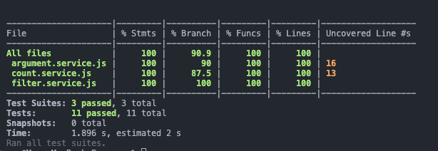

## Filter

Write a command-line interface in Node.js. 
This program has to filter a list of elements containing a pattern.

Details:
- In the following file `data.js`, there are `Countries` containing `Peoples` containing `Animals`.
- Only animals containing the pattern passed as argument (e.g. `ry`) are displayed. The order should be kept intact.
- Empty array after filtering are NOT returned.

Sample of running the command, and its output:

```shell script
$ node app.js --filter=ry
[
  {
    name: 'Uzuzozne',
    people: [
      {
        name: 'Lillie Abbott',
        animals: [
          {
            name: 'John Dory'
          }
        ]
      }
    ]
  },
  {
    name: 'Satanwi',
    people: [
      {
        name: 'Anthony Bruno',
        animals: [
          {
            name: 'Oryx'
          }
        ]
      }
    ]
  }
]
```

## Count

The next goal is to print the counts of People and Animals by counting the number of children and appending it in the name, eg. `Satanwi [2]`.

Sample of running the command, and its output:

```shell script
node app.js --count
[ { name: 'Dillauti [5]',
    people:
     [ { name: 'Winifred Graham [6]',
         animals:
          [ { name: 'Anoa' },
            { name: 'Duck' },
            { name: 'Narwhal' },
            { name: 'Badger' },
            { name: 'Cobra' },
            { name: 'Crow' } ] },
       { name: 'Blanche Viciani [8]',
         animals:
          [ { name: 'Barbet' },
            { name: 'Rhea' },
            { name: 'Snakes' },
            { name: 'Antelope' },
            { name: 'Echidna' },
            { name: 'Crow' },
            { name: 'Guinea Fowl' },
            { name: 'Deer Mouse' } ] },
      ...
...
]
```

## Requirements

- The code must be available in a GIT repository
- No library/modules should be used, except for the testing library

## Appreciation

- Code readability, structure and consistency
- Tests, and how they are written

## Coverage Results


